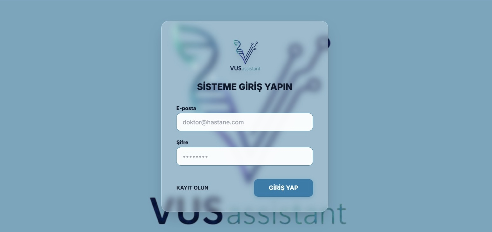
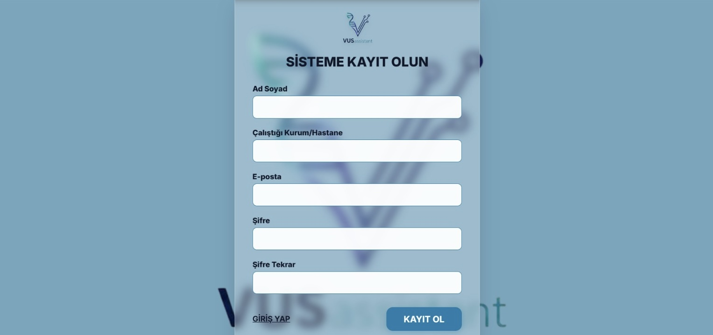
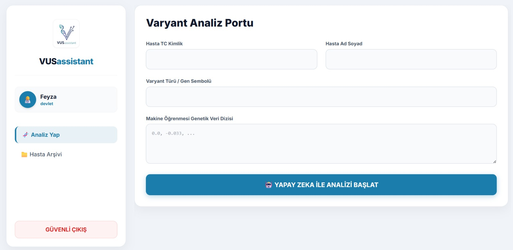
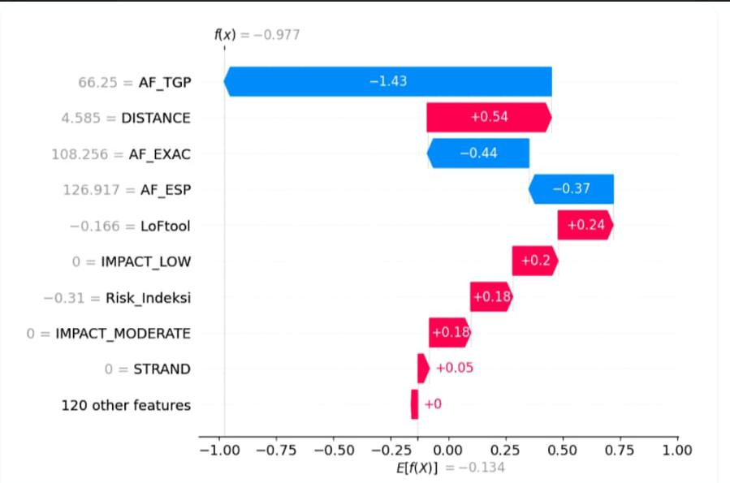

# 🧬 VUSassistant

## Proje Hakkında

VUSassistant, missense genetik varyantların patojenite tahminini gerçekleştirmek amacıyla geliştirilmiş yapay zeka destekli bir web tabanlı analiz sistemidir.

Sistem, genetik varyantların **Patojenik** veya **Benign** olup olmadığını tahmin ederek klinisyenlerin karar süreçlerine destek sağlamaktadır.

Bu proje, hem Karadeniz Teknik Üniversitesi Software Engineering dersi kapsamında geliştirilmekte hem de TEKNOFEST 2026 Sağlıkta Yapay Zeka Yarışması için hazırlanmıştır.

---

# Projenin Amacı

Genetik varyantların yorumlanması, klinik genetik alanındaki en zor ve zaman alan süreçlerden biridir. Özellikle belirsiz varyantların değerlendirilmesi uzmanlık gerektirmektedir.

Bu proje kapsamında:

- Genetik varyant analiz süreci hızlandırılmış,
- Klinik karar destek yaklaşımı geliştirilmiş,
- Açıklanabilir yapay zeka yöntemleri kullanılmış,
- Kullanıcı dostu bir analiz platformu oluşturulmuştur.

---

# 🚀 Öne Çıkan Özellikler

- Yapay zeka destekli varyant sınıflandırması
- Risk skoru üretimi
- SHAP tabanlı açıklanabilirlik analizleri
- Web tabanlı kullanıcı arayüzü
- KVKK uyumlu veri yaklaşımı
- Hızlı analiz ve sonuç üretimi
- VCF / CSV veri desteği

---

# Yapay Zeka Altyapısı

Proje içerisinde genetik varyantların analiz edilmesi amacıyla makine öğrenmesi modelleri kullanılmıştır.

Kullanılan bazı teknolojiler:

- XGBoost
- LightGBM
- Scikit-learn
- SHAP
- Optuna

Model geliştirme sürecinde:

1. Veri temizleme
2. Eksik veri tamamlama (MICE)
3. Özellik mühendisliği
4. Model eğitimi
5. Tahmin üretimi
6. Açıklanabilirlik analizi

adımları uygulanmıştır.

---

# Sistem Yapısı

VUSassistant modüler bir mimari ile geliştirilmiştir.

## Branch Yapıları

### `web`

Frontend geliştirmeleri ve kullanıcı arayüzü çalışmaları bu branch üzerinde gerçekleştirilmiştir.

#### İçerikler

- React tabanlı arayüz geliştirmeleri
- Kullanıcı deneyimi çalışmaları
- Grafik ve görselleştirme işlemleri
- API bağlantıları

---

### `machine-learning`

Makine öğrenmesi ve veri analizi süreçleri bu branch üzerinde geliştirilmiştir.

#### İçerikler

- Veri ön işleme
- Model eğitimi
- SHAP analizleri
- Tahmin sistemleri
- Performans değerlendirmeleri

---

# Kullanılan Teknolojiler

## Frontend

- React
- HTML
- CSS
- JavaScript

## Backend

- Python
- FastAPI

## Yapay Zeka

- XGBoost
- LightGBM
- Scikit-learn
- SHAP
- Optuna
- Pandas
- NumPy

## Diğer Araçlar

- Git
- GitHub
- REST API

---

# 📂 Proje Yapısı

```bash
VUSassistant/
│
├── docs/
├── images/
├── models/
├── __pycache__/
│
├── main.py
├── rule_engine.py
├── xai_explainer.py
├── veri.temizlik.py
├── feature_list.json
├── makine ogrenmesi.py
│
├── index.html
├── logo.png
│
├── README.md
├── .gitignore
```

---

# 📄 Proje Dokümanları

Proje geliştirme sürecinde hazırlanan raporlar aşağıda yer almaktadır:

- [📄 Gereksinim Analizi Raporu](docs/gereksinim_analizi_raporu.pdf)

- [📄 Mimari Tasarım Raporu](docs/mimari_tasarim_raporu.pdf)

- [📄 Proje Sonuç Raporu](docs/proje_sonuc_raporu.pdf)

---

# 🖼️ Sistem Görselleri

## Giriş ve Kayıt Ekranı







---

## Analiz Ekranı





---

## SHAP Analiz Görseli





---

# Kurulum

## Repository Klonlama

```bash
git clone https://github.com/nida-ktg/VUSassistant.git
```

## Proje Klasörüne Geçiş

```bash
cd VUSassistant
```

## Gerekli Paketlerin Kurulması

```bash
pip install -r requirements.txt
```

## Uygulamayı Çalıştırma

```bash
python main.py
```

---


# 🚀 Gelecek Çalışmalar

- Toplu veri yükleme desteği
- Bulut entegrasyonu
- Gelişmiş anonimleştirme sistemi
- Gerçek zamanlı analiz altyapısı
- Mobil uygulama desteği

---

# 📄 Lisans

Bu proje eğitim, araştırma ve geliştirme amaçlı hazırlanmıştır.